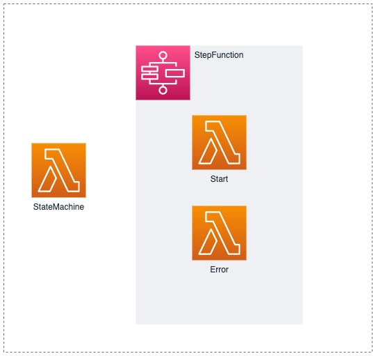
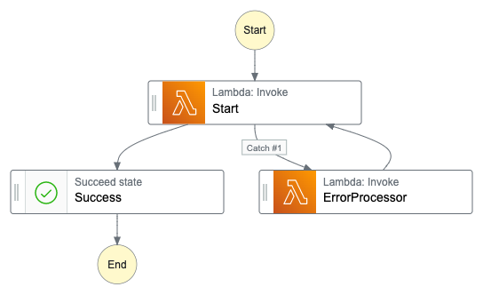

# StepFunctions Example

### Diagram:



### Flow:



## Description
This repository contains the code that allows to build simple demonstration of StepFunction integration with Lambda and `WaitForTaskToken` capability.

## Deploying
To deploy this solution you need to have:
* Valid AWS CLI credentials
* `terraform` with version 1.1.2
* This repository cloned :)

---
**NOTE**

Due to the nature of some dependency logic inside the AWS Step Function module that doesn't work properly (and `depends_on` doesn't work either) hence deployment need to run in stages.

---

Deploy Start and Error Lambda functions

```
terraform apply -target module.start -target module.error
```
then apply the rest:
```
terraform apply
```
